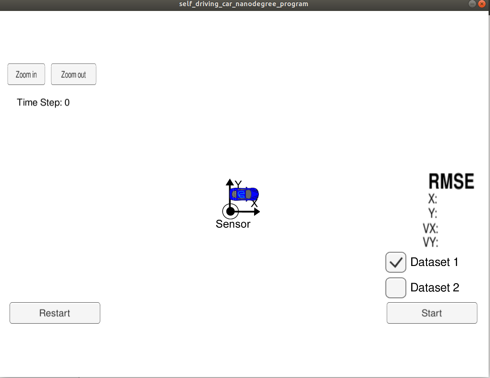
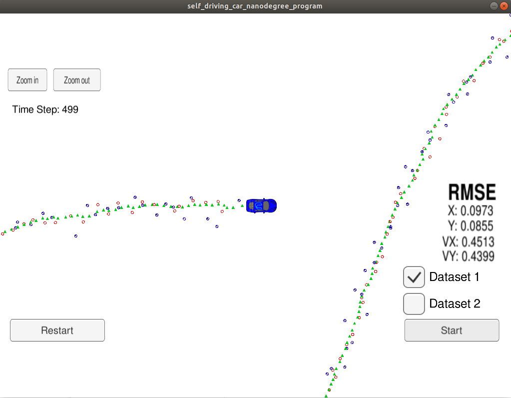

# Extended Kalman Filter Project Starter Code

This project uses a kalman filter to estimate the state of a moving object of interest with noisy lidar and radar measurements. The program was developed using C++.

---

## Simulator

This project involves the use of Term 2 Simulator which can be downloaded [here](https://github.com/udacity/self-driving-car-sim/releases)

## Input and output

INPUT: values provided by the simulator to the c++ program

["sensor_measurement"] => the measurement that the simulator observed (either lidar or radar)


OUTPUT: values provided by the c++ program to the simulator

["estimate_x"] <= kalman filter estimated position x
["estimate_y"] <= kalman filter estimated position y
["rmse_x"]
["rmse_y"]
["rmse_vx"]
["rmse_vy"]

## Important Dependencies before compiling and running

*  Install [uWebSocketIO](https://github.com/uWebSockets/uWebSockets) for either Linux or Mac systems. For windows you can use either Docker, VMware, or even [Windows 10 Bash on Ubuntu](https://www.howtogeek.com/249966/how-to-install-and-use-the-linux-bash-shell-on-windows-10/) to install uWebSocketIO.
* cmake >= 3.5
  * All OSes: [click here for installation instructions](https://cmake.org/install/)
* make >= 4.1 (Linux, Mac), 3.81 (Windows)
  * Linux: make is installed by default on most Linux distros
  * Mac: [install Xcode command line tools to get make](https://developer.apple.com/xcode/features/)
  * Windows: [Click here for installation instructions](http://gnuwin32.sourceforge.net/packages/make.htm)
* gcc/g++ >= 5.4
  * Linux: gcc / g++ is installed by default on most Linux distros
  * Mac: same deal as make - [install Xcode command line tools](https://developer.apple.com/xcode/features/)
  * Windows: recommend using [MinGW](http://www.mingw.org/)


## Build Instructions

1. Clone this repo.
2. Make a build directory: `mkdir build && cd build`
3. Compile: `cmake .. && make` 
   * On windows, you may need to run: `cmake .. -G "Unix Makefiles" && make`
4. Run it: `./ExtendedKF `
5. Open the simulator
6. Hit the `START` button to observe how the object moves and how measurement markers are positioned in the data set.

Simulator notes: For more experimentation, "Data set 2" is included which is a reversed version of "Data set 1", also the second data set starts with a radar measurement where the first data set starts with a lidar measurement. At any time you can press the PAUSE button, to pause the scene or hit the RESTART button to reset the scene. Also the ARROW KEYS can be used to move the camera around, and the top left ZOOM IN/OUT buttons can be used to focus the camera. Pressing the ESCAPE KEY returns to the simulator main menu.

## Examples

* After running the C++ program and the simulator, the console output should be something like:

```
./ExtendedKF 
Listening to port 4567
Connected!!!
EKF init: 
EKF : LASER Initial state
x_ = 0.779913
0.722413
 6.65259
 1.97674
P_ =   0.0188397   0.0342893  0.00441314 -0.00217457
  0.0342893   0.0641216 -0.00217459  0.00154144
 0.00441314 -0.00217459     221.662    -119.214
-0.00217457  0.00154144    -119.214     64.2309
x_ =    1.19545
  0.535063
   10.3167
-0.0105176
P_ =   0.0208892 -0.00171888    0.338288   -0.181386
-0.00171888   0.0186193   -0.181386   0.0987523
   0.338288   -0.181386     6.90495    -3.65473
  -0.181386   0.0987523    -3.65473     2.07857
x_ =  1.03211
0.563929
 4.61321
  2.6006
P_ =  0.00541299  0.00283651   0.0212963  -0.0229234
 0.00283651  0.00355763  0.00694422 -0.00320269
  0.0212963  0.00694422    0.130431   -0.102783
 -0.0229234 -0.00320269   -0.102783    0.225232
...
```

* Simulator start looks like:




* Simulator end looks like:



